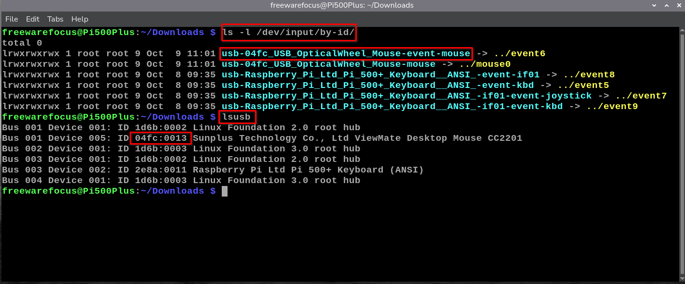
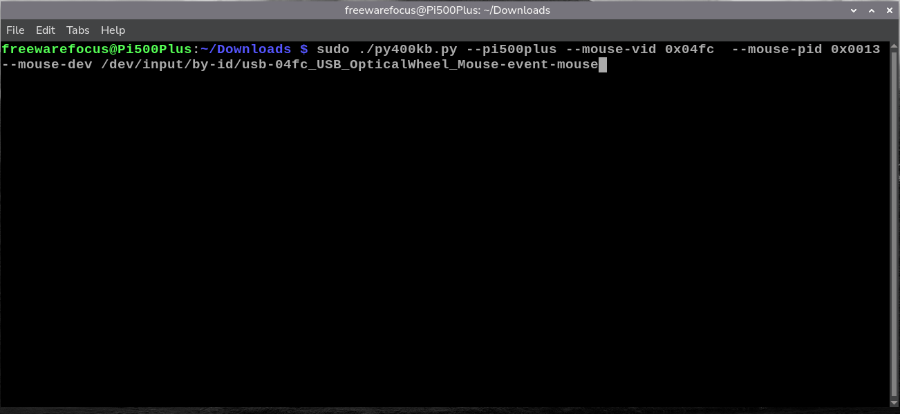

# Use a Raspberry Pi 4, 5, 400, 500 or 500+ as a HID USB Mouse &amp; Keyboard

This project is a Python rewrite of the C project pi400kb by Gadgetoid (https://github.com/Gadgetoid/pi400kb/).
The goal was to remove some legacy features no longer found in the Pi 500 & 500+ and add the ability to define a custom keyboard or mouse without having to recompile

This program allows a Raspberry pi4, pi5, pi400, pi500 or pi500+ to act as a keyboard & mouse for another computer. You can use a handy preset for the pi400, 500 or 500+ and the official Raspberry Pi Mouse or pass in custom values for the keyboard & mouse to support newer models or custom hardware. It also supports recording and playing back keyboard and mouse macro files.

## Changes from Original C Version

1. **Removed hook.sh call** - The LED toggle script is no longer called (that LED doesn't exist under newer Pix00 models)
2. **Added command-line model selection** - `--pi400`, `--pi500`, `--pi500plus`
3. **Added parameter overrides** - All VID/PID/device paths can be overridden at run time
4. **Pure Python implementation** - No need for cmake or compilation & no Python libraries need to be added
5. **Improved error handling** - Better error messages & graceful cleanup
6. **More feedback** - Added additonal status messages and a --help command line option
7. **Added Macro Record/Playback** - Now supports recording and playing back keyboard and mouse sessions

## Features

- Forwards internal keyboard & a connected mouse HID reports out of the Pi's USB C port to another computer
- Build in support for Pi 400, Pi 500, Pi 500+ and Pi4 & 5 with the command-line configuration
- Toggle capture on/off with Ctrl+Raspberry key
- Exit with Ctrl+Shift+Raspberry key
- Command-line overrides for all device parameters for custom mice & keyboards
- The raw keyboard & mouse inputs are shown in the terminal window (K: 00 00 00 00 00 00 00 00 or M: 00 00 00 00). NOTE: This output can be hidden with the --hide-events command line option
- The --record-macro {filename} and --play-macro {filename} allow you to record a keyboard & mouse session and then play it back exactly as it occurred once again

## Requirements

- Python 3.6 or later
- Root access (required for USB gadget and device grabbing)
- Raspberry Pi with USB C gadget mode support (currently the Pi 4, Pi 5, Pi 400, Pi 500 & Pi 500+)
- The **ONLY** port on the Pi4, Pi5, Pi400, Pi500 & Pi500+ that can use as a HID device is the USB C power port.
  Since the destination PC's USB ports can't provide enough power to run any of these, **you will need a USB C power & data splitter**.

  I used this model from Amazon, although I am sure several others could work and are available from other retailers. Make sure you look for a "USB C to OTG" adapter that is designed for 20+ watts.
  
  This model has a USB C female connector to accept power from a Raspberry Pi 400/500 compatible power adapter and a separate USB A female port, which passes data to the Pi's USB C port. You will need a male to male USB A cable or an male A to male C cable to go from the splitter to your destination PC. Make sure this cable is capable of passing USB data and isn't just a charging cable.
  
  Amake USB C to USB OTG Adapter,2-in-1 USB-C Distributor,100W Fast Charging: 
  www.amazon.com/dp/B0F6SRN24Y

  For the USB A to A cable I used this model (again many brands and vendors should work): 
  
  SB 3.0 Male to Male Cable 3Ft,USB to USB Cable with Gold-Plated Connector
  www.amazon.com/Jelly-Tang-USB-3-0-3Ft/dp/B07KJFWYXF

  For testing I used the above cables & adapters along with an official Raspberry Pi 45 watt USB C power adapter, the official Raspberry Pi USB mouse and a Pi400 & a Pi500+. Although this combination of equipment worked fine for me, **I am not responsible for damage caused by attempting to turn your Pi into an external keyboard & mouse**. Always check adapters and cables to make sure they are providing the correct power to the correct places.

## Installation

1) Add the following to your boot/firmware/config.txt file just below [all] section at the bottom```
```bashoutput
dtoverlay=dwc2,dr_mode=peripheral
```

2) Reboot to have the config.txt change take effectname

3) Ensure the required kernel modules are available:
```bash
sudo modprobe libcomposite
```

4) Download py400kb.py from this repo and make the script executable with this command (or use the Pi OS GUI):
```bash
chmod +x py400kb.py
```

If not made executable, you can still run it like this instead:
```bash
sudo python py400kb.py
```

## Usage

### Basic Usage

**Pi 400 (default) and official Raspberry Pi Mouse:**
```bash
sudo ./py400kb.py --pi400
```

**Pi 500 and official Raspberry Pi Mouse:**
```bash

sudo ./py400kb.py --pi500
```

**Pi 500+ (pi500plus) and official Raspberry Pi Mouse:**
```bash
sudo ./py400kb.py --pi500plus
```

## Keyboard Shortcuts

While running:
- **Ctrl + Raspberry Pi Key** - Toggle input capture on/off
- **Ctrl + Shift + Raspberry Pi Key** - Exit the program

## Full Command-Line Options

#### Model Presets
- `--pi400` - Use Pi 400 configuration (default)
- `--pi500` - Use Pi 500 configuration
- `--pi500plus` - Use Pi 500+ configuration

#### Keyboard Overrides
- `--keyboard-vid VID` - Keyboard vendor ID (hex or decimal, e.g., 0x2a8f or 10895)
- `--keyboard-pid PID` - Keyboard product ID (hex or decimal)
- `--keyboard-dev PATH` - Keyboard device path

#### Mouse Overrides
- `--mouse-vid VID` - Mouse vendor ID (hex or decimal)
- `--mouse-pid PID` - Mouse product ID (hex or decimal)
- `--mouse-dev PATH` - Mouse device path

#### Macro Options
- `--record-macro filename` - Records a macro to a file in JSONL format
- `--play-macro filename` - Plays back a recorded macro file and then quits afer playback

#### Other Options
- `--no-usb` - Disable USB output (testing/debugging mode)
- `--hide-events` - Don't show mouse & keyboard raw input on the screen
- `--help` - Show py400kb command line parameters

### Examples

**Custom keyboard VID/PID:**
```bash
sudo ./py400kb.py --keyboard-vid 0x2a8a --keyboard-pid 0x0210
```

**Override specific device path:**
```bash
sudo ./py400kb.py --pi500 --keyboard-dev /dev/input/by-id/custom-keyboard-path
```

**Custom keyboard configuration**
```bash
sudo ./py400kb.py --keyboard-vid 0x045e --keyboard-pid 0x000b --keyboard-dev /dev/input/by-id/usb-045e_Microsoft_Natural_Keyboard_Elite-event-kbd
```

**Complete custom configuration:**
```bash
sudo ./py400kb.py \
    --keyboard-vid 0x2e8a \
    --keyboard-pid 0x0010 \
    --keyboard-dev /dev/input/by-id/usb-Raspberry_Pi_Ltd_Pi_500_Keyboard-event-kbd \
    --mouse-vid 0x093a \
    --mouse-pid 0x2510 \
    --mouse-dev /dev/input/by-id/usb-PixArt_USB_Optical_Mouse-event-mouse
```

**Testing mode (no USB output):**
```bash
sudo ./py400kb.py --pi400 --no-usb
```

**Recording a Macro file:**
```bash
sudo ./py400kb.py --pi500plus --record-macro mymacro.jsonl
```

**Playback a Macro file:**
```bash
sudo ./py400kb.py --pi500plus --play-macro mymacro.jsonl
```

## Using a different keyboard and/or mouse 

If you want to plug in a differnet keyboard or mouse instead of using one of the presets (--pi400, --pi500, --pi500plus) then you will need to pass in the device's HID, PID and device name. If you are just using a different mouse, for example, you can still use a preset and pass in an override just for the mouse. These commands were tested on Pi OS Bookworm & Trixie.

**Commands to identify a new keyboard or mouse in Pi OS**
- List keyboards & mice for use wth the --keboard-dev & --mouse-dev arguments. Look for the one with "event" in it's name:
```bash
ls -l /dev/input/by-id/
```

NOTE: On the command line, make sure you include the **full path** (/dev/input/by-id/) to the name of the mouse or keyboard:
```bash
--keyboard-dev /dev/input/by-id/usb-Raspberry_Pi_Ltd_Pi_500_Keyboard-event-kbd
```

- Find the vid & pid values for the --keyboard[mouse]-vid & keyboard[mouse]-pid arguments
NOTE: VID stands for Vendor ID and PID stands for Product ID - these identify a specific keyboard or mouse made by a vendor
```bash
lsusb
```

- Finding the vid & pid in the output (sample line):
```bash
2e8a:0011 Raspberry Pi Ltd Pi 500+ Keyboard (ANSI)
VID : PID
```

NOTE: Since these are hex values you need to pre-append '0x' to these numbers on the command line (or convert them to decimal):
```bash
--keyboard-vid 0x2e8a --keyboard-pid 0x0011
```

**Full Custom Mouse Example**

On a Raspberry Pi 500+ I am going to use the built in keyboard but I have a different mouse than the official Raspberry Pi one. This means I can use the --pi500plus command line option to automatically select the keyboard but I will need to override the mouse setting. Here is how I do that:

- Run the ls -l /dev/input/by-id/ and lsusb commands and identify the mouse's device name (look for "event") and VID (first number) and PID (second number):



- On the command line I make sure to include the --pi500plus argument to identify the keyboard, but then add the custom mouse's VID, PID and DEV commands.

Note that I include the "0x" before the VID and PID numbers (because they are hexidecimal) and the path "/dev/input/by-id/" before the mouse's device name:



- So you don't have to type this line in each time, you can create a bash (command) file and name it something like "my-py400kb.sh" on your desktop:

```bash
#!/bin/bash
# ---------------------------------------------------------------------------
# my-py400kb.sh
# Run py400kb.py with the Pi 500+ keyboard and custom mouse device settings
# ---------------------------------------------------------------------------

sudo ./py400kb.py \
    --pi500plus \
    --mouse-vid 0x04fc \
    --mouse-pid 0x0013 \
    --mouse-dev /dev/input/by-id/usb-04fc_USB_OpticalWheel_Mouse-event-mouse
```

- Make it executable with this terminal command or using the Pi OS GUI:

```bash
chmod +x my-py400kb.sh
```

- And run it like this:

```bash
./my-py400kb.sh
```

## Troubleshooting

**"No devices to forward"**
- Check that the VID/PID values match your hardware
- Run `lsusb` to find the correct vendor/product IDs
- Check that hidraw devices exist: `ls -la /dev/hidraw*`

**"This program must be run as root"**
- Use `sudo ./py400kb.py` to run the script

**"Error opening /dev/hidg0"**
- Ensure USB gadget mode is supported on your hardware
- Check that the libcomposite module is loaded: `lsmod | grep libcomposite`

**Device not found**
- Check device paths exist: `ls -la /dev/input/by-id/`

**Destination computer not responding**
- The program will continue to run even if the USB cable is not connected to the destination computer
- Connect the USB cable to the destination computer to start forwarding input

## Thanks & Contributions
This project would not have been possible without the coding work of Gadgetoid and his original C version of pi400kb. This Python program is closely based on the core of the original code.
Original Project: pi400kb by Gadgetoid (https://github.com/Gadgetoid/pi400kb/)

## License

MIT License - same as the original (pi400kb) project
